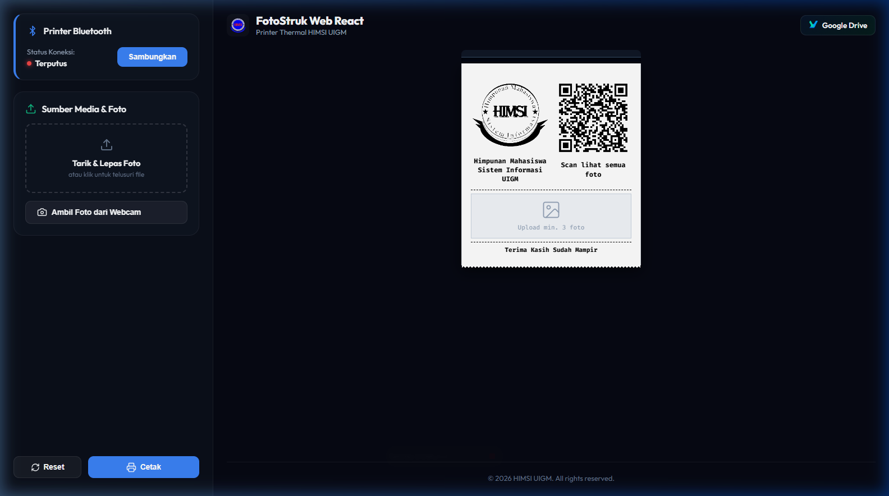
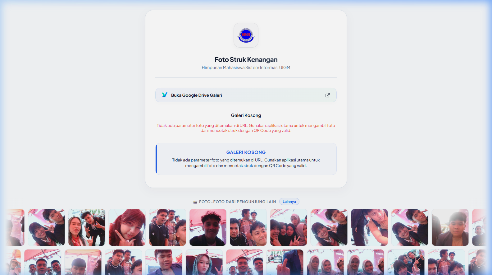
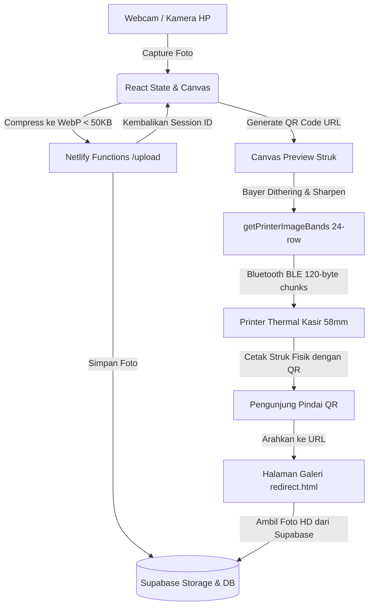

# 📸 FotoStruk Web — Sistem Cetak Struk Foto Booth Thermal (HIMSI UIGM)

[](https://app.netlify.com/projects/fotostruksi-himsi-uigm/deploys)
[](https://vitejs.dev/)
[](https://react.dev/)
[](https://supabase.com/)


**FotoStruk Web** adalah aplikasi photobooth berbasis web modern yang dirancang khusus untuk event eksibisi **Himpunan Mahasiswa Sistem Informasi UIGM**. Dengan aplikasi ini, pengunjung bisa foto-foto seru lewat webcam laptop/HP, menyusunnya dalam layout strip/grid yang estetik, mengunggah foto ke cloud secara instan, lalu mencetaknya langsung ke printer kasir thermal (thermal receipt printer) via koneksi **Bluetooth (BLE)** dalam bentuk struk kenangan unik lengkap dengan **QR Code**.

## 🖥️ Tampilan Aplikasi

| 📱 Halaman Utama & Preview Struk | 🖼️ Galeri Online Pengunjung (Hasil Scan QR) |
| :---: | :---: |
|  |  |

---

## ✨ Fitur Unggulan

### 1. 📷 Kamera Pintar (Auto-Unmirror)
* **Depan & Belakang**: Mendukung kamera webcam laptop maupun kamera depan/belakang smartphone secara responsif.
* **Anti Terbalik (Auto-Unmirror)**: Saat selfie menggunakan kamera depan, sistem otomatis membalik foto secara horizontal agar teks di background (seperti spanduk/logo HIMSI) tetap terbaca dengan normal dari kiri ke kanan.
* **Tombol Cepat (Toggle)**: Tersedia tombol manual di menu kamera jika Anda ingin tetap menyimpan foto dengan efek cermin (selfie mirror).

### 2. 🧩 Pilihan Layout Kolase (Strip & Grid)
* **Strip Layout**: Menyusun foto secara vertikal ke bawah dengan frame garis hitam di kiri-kanan yang terputus manis pada celah (gap) putih pemisah antar foto.
* **Grid Layout**: Mengelompokkan foto secara otomatis ke dalam layout grid kolom (2 sampai 3 kolom tergantung jumlah foto).
* **Mudah Pilih Foto (UX)**: Cukup ketuk foto mana saja di sidebar untuk memilih/membatalkan cetak, dengan indikator centang besar (**26px**) yang ramah jari di layar HP.

### 3. ⚙️ Pemrosesan Gambar Optimal untuk Printer Thermal
* **Bayer 8x8 Dithering**: Mengubah foto berwarna menjadi pola titik-titik monokrom halus (*halftone*) seperti cetakan koran, sehingga detail foto tetap jelas dan printer tidak kepanasan akibat mencetak warna hitam pekat.
* **Sharpening & Sigmoid Contrast**: Otomatis mempertajam tepi gambar dan menyeimbangkan kontras agar wajah terlihat lebih bersih dan tidak blur saat dicetak di resolusi rendah.
* **Slider Kecerahan & Kontras**: Atur kecerahan foto secara langsung di layar sebelum tombol cetak ditekan.
* **Gamma Correction (1.3)**: Mengoreksi tone tengah gambar agar hasil cetak fisik tidak terlalu gelap atau buram dibanding versi layar.

### 4. ⚡ Cetak Bluetooth Cepat & Lancar (Bebas Garis Putih)
* **Band Printing (24 Baris)**: Memecah gambar panjang menjadi potongan horizontal kecil setinggi 24 baris agar printer kasir (yang memorinya kecil) tidak hang/crash akibat kelebihan beban.
* **Transmisi Super Cepat**: Menggunakan chunk kiriman **120 bytes** dengan delay super singkat (10ms / 2ms), membuat struk tercetak hanya dalam **~2-3 detik**.
* **Anti Garis-Garis (Anti Kedat-Deut)**: Meminimalkan jeda antar-kiriman data menjadi **15ms** agar motor penarik kertas printer terus berputar lancar tanpa henti mendadak. Hasil foto menjadi bersih dan bebas dari garis-garis putih horizontal akibat hentakan dinamo.

### 5. ☁️ Unggah Cloud Instan & Galeri Scan QR
* **Kompresi WebP**: Foto dikompres otomatis ke format WebP di bawah **50KB** agar proses unggah secepat kilat dan hemat kuota.
* **QR Code Dinamis**: Struk fisik memiliki QR Code unik di bagian atas. Ketika pengunjung memindai QR tersebut, mereka akan langsung masuk ke halaman galeri online responsif (`redirect.html`) untuk mengunduh foto kualitas asli (HD) dan membagikannya ke media sosial.


---

## 🛠️ Tech Stack
* **Frontend**: React 19, Vite 8, Lucide React (Icons), QRious (QR Code generator)
* **Styling**: Vanilla CSS (Premium Glassmorphism & Dark Mode)
* **Backend**: Netlify Functions (Node.js) untuk serverless proxy dan upload handler
* **Database & Cloud Storage**: Supabase (Database postgres + Storage Buckets)

---

## 🔌 Arsitektur Sistem



---

## 🚀 Tutorial & Langkah Setup Lokal

### Prasyarat
1. **Node.js** versi 18 atau yang lebih baru.
2. Akun **Supabase** (gratis) untuk penyimpanan foto.
3. Akun **Netlify** (gratis) jika ingin men-deploy.

### Langkah 1: Clone Repository & Install Dependency
Buka terminal/command prompt di komputer Anda, lalu jalankan perintah berikut:
```bash
# Clone project
git clone https://github.com/username/fotostruksi.git
cd fotostruksi

# Install library pendukung
npm install
```

### Langkah 2: Konfigurasi Database Supabase
1. Buat project baru di dasbor Supabase Anda.
2. Masuk ke menu **SQL Editor**, buat query baru, salin isi file [supabase_setup.sql](file:///c:/xampp/htdocs/fotostruksi/supabase_setup.sql) ke editor tersebut, lalu jalankan (**Run**). Ini akan membuat tabel `photo_sessions` dan bucket storage bernama `photos` dengan kebijakan akses publik (R/W).

### Langkah 3: Pengaturan Environment Variable (.env)
Buat file baru bernama `.env` di direktori root proyek (sejajar dengan `package.json`). Gunakan template di bawah ini dan isi dengan kredensial Supabase Anda:
```env
# Salin isi dari .env.example
SUPABASE_URL=https://id-project-supabase-anda.supabase.co
SUPABASE_SERVICE_KEY=api-key-service-role-supabase-anda
```
> [!IMPORTANT]
> Jangan pernah mengunggah file `.env` berisi key asli Anda ke GitHub. File `.env` sudah dimasukkan ke dalam daftar `.gitignore` agar aman secara otomatis.

### Langkah 4: Menjalankan Server Lokal
Untuk menjalankan server pengembangan lokal (local development), jalankan perintah:
```bash
npm run dev
```
Aplikasi akan aktif di alamat: [http://localhost:5173/](http://localhost:5173/)

---

## 🖨️ Cara Mengubungkan ke Printer Thermal di HP/Laptop

1. **Persiapan Printer**: Nyalakan printer thermal bluetooth Anda dan pastikan kertas thermal terpasang di dalamnya.
2. **Koneksi di Aplikasi**:
   * Tekan tombol **Hubungkan Printer** di panel kontrol aplikasi.
   * Browser akan menampilkan jendela pencarian Bluetooth. Pilih perangkat printer Anda (biasanya bernama *MTP-II*, *PT-210*, atau nama sejenis) lalu klik **Pair/Hubungkan**.
3. **Mencetak**:
   * Setelah status berubah menjadi **Terhubung**, ambil minimal 3 foto menggunakan tombol webcam atau upload manual.
   * Atur tingkat keterangan dan layout struk, lalu tekan tombol **Cetak**.
   * Printer akan mencetak struk secara kontinu dalam hitungan detik.

---

## 🌐 Panduan Deploy ke Netlify

Proyek ini telah dikonfigurasi untuk langsung dideploy menggunakan Netlify CLI.

1. Install Netlify CLI secara global (jika belum):
   ```bash
   npm install -g netlify-cli
   ```
2. Login ke akun Netlify Anda via terminal:
   ```bash
   netlify login
   ```
3. Lakukan build produksi proyek:
   ```bash
   npm run build
   ```
4. Hubungkan proyek lokal dengan Netlify dan jalankan deploy:
   ```bash
   # Deploy versi Draft (Pencegahan)
   npx netlify deploy
   
   # Deploy langsung ke versi Live Produksi
   npx netlify deploy --prod
   ```
5. Buka dashboard Netlify Anda, masuk ke **Site configuration** -> **Environment variables**, dan tambahkan key `SUPABASE_URL` dan `SUPABASE_SERVICE_KEY` dengan nilai yang sama seperti di file `.env` Anda agar fungsi upload serverless berjalan dengan benar.

---

## 👥 Kontributor & Lisensi
* **Pengembang**: Himpunan Mahasiswa Sistem Informasi UIGM (HIMSI UIGM)
* **Lisensi**: MIT License - silakan gunakan dan modifikasi proyek ini untuk keperluan pameran atau event komunitas Anda!
